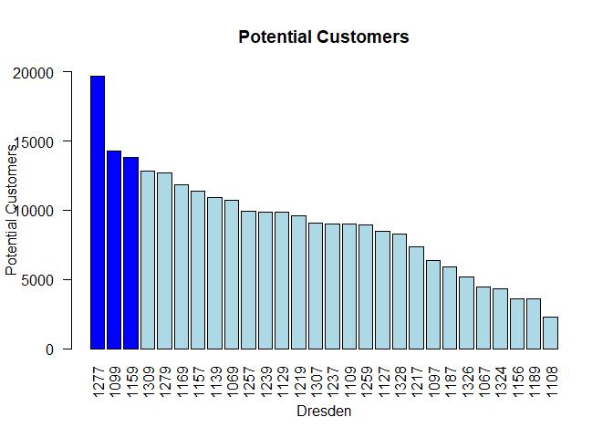
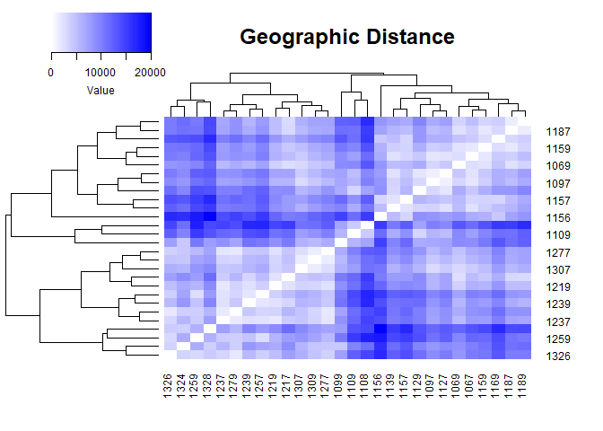
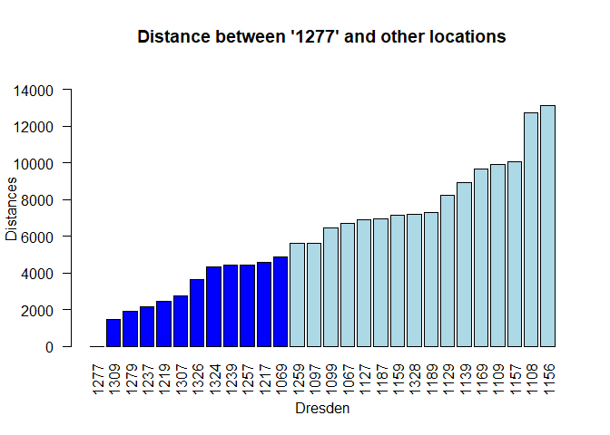
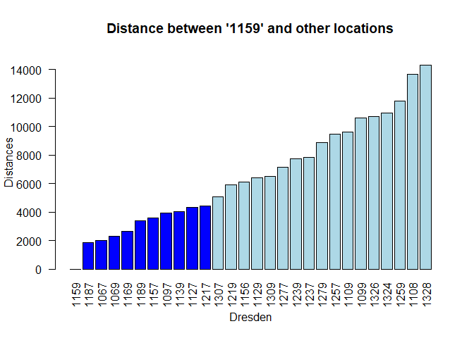
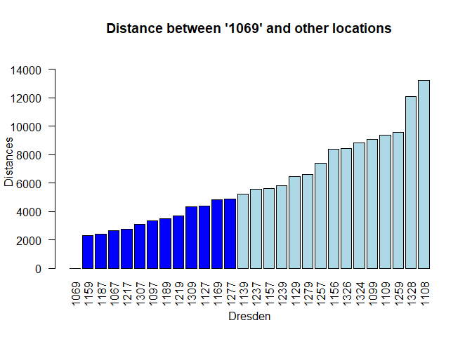
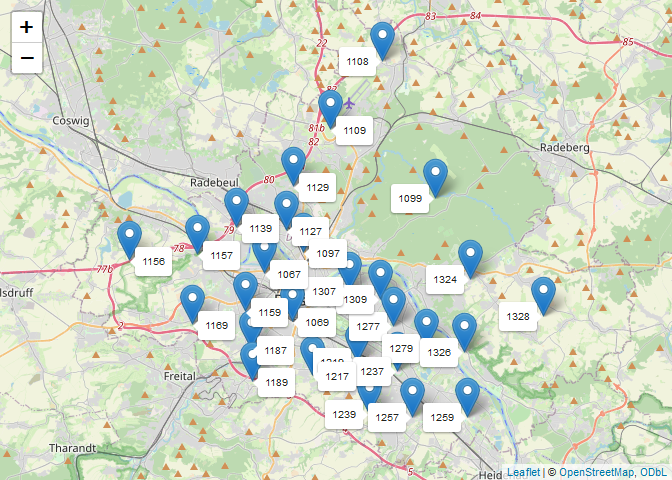
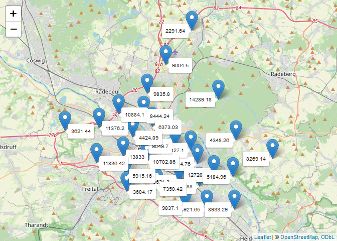
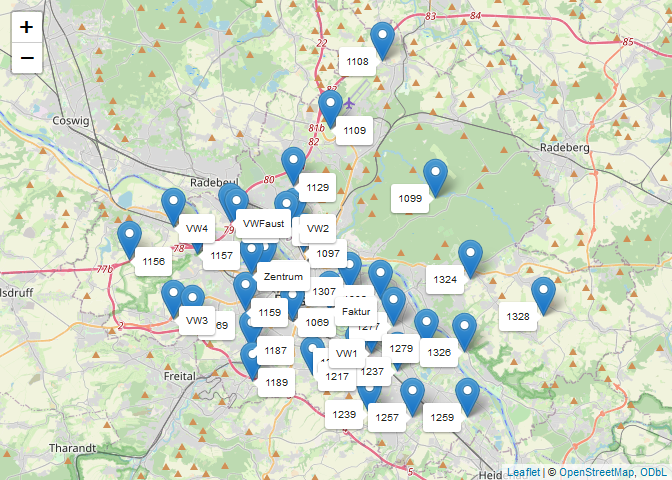

R_auto_store_selection
================
SYsherley
2023-11-10

## Selection of electric vehicle store locations

``` r
# library
library(tidyverse)
```

    ## ── Attaching core tidyverse packages ──────────────────────── tidyverse 2.0.0 ──
    ## ✔ dplyr     1.1.1     ✔ readr     2.1.4
    ## ✔ forcats   1.0.0     ✔ stringr   1.5.0
    ## ✔ ggplot2   3.4.2     ✔ tibble    3.2.1
    ## ✔ lubridate 1.9.2     ✔ tidyr     1.3.0
    ## ✔ purrr     1.0.1     
    ## ── Conflicts ────────────────────────────────────────── tidyverse_conflicts() ──
    ## ✖ dplyr::filter() masks stats::filter()
    ## ✖ dplyr::lag()    masks stats::lag()
    ## ℹ Use the conflicted package (<http://conflicted.r-lib.org/>) to force all conflicts to become errors

``` r
library(languageR)
library(readxl)
library(ez)
library(lme4)
```

    ## Loading required package: Matrix
    ## 
    ## Attaching package: 'Matrix'
    ## 
    ## The following objects are masked from 'package:tidyr':
    ## 
    ##     expand, pack, unpack

``` r
library(QuantPsyc)
```

    ## Loading required package: boot
    ## Loading required package: MASS
    ## 
    ## Attaching package: 'MASS'
    ## 
    ## The following object is masked from 'package:dplyr':
    ## 
    ##     select
    ## 
    ## 
    ## Attaching package: 'QuantPsyc'
    ## 
    ## The following object is masked from 'package:Matrix':
    ## 
    ##     norm
    ## 
    ## The following object is masked from 'package:base':
    ## 
    ##     norm

``` r
library(Hmisc)
```

    ## 
    ## Attaching package: 'Hmisc'
    ## 
    ## The following objects are masked from 'package:dplyr':
    ## 
    ##     src, summarize
    ## 
    ## The following objects are masked from 'package:base':
    ## 
    ##     format.pval, units

``` r
library(ggplot2)
library(ggpubr)
library(permutes)
library(kableExtra)
```

    ## 
    ## Attaching package: 'kableExtra'
    ## 
    ## The following object is masked from 'package:dplyr':
    ## 
    ##     group_rows

``` r
library(tibble) # rownames_to_column
library(lmPerm)
library(scales)
```

    ## 
    ## Attaching package: 'scales'
    ## 
    ## The following object is masked from 'package:purrr':
    ## 
    ##     discard
    ## 
    ## The following object is masked from 'package:readr':
    ## 
    ##     col_factor

``` r
library(plotly)
```

    ## 
    ## Attaching package: 'plotly'
    ## 
    ## The following object is masked from 'package:Hmisc':
    ## 
    ##     subplot
    ## 
    ## The following object is masked from 'package:MASS':
    ## 
    ##     select
    ## 
    ## The following object is masked from 'package:ggplot2':
    ## 
    ##     last_plot
    ## 
    ## The following object is masked from 'package:stats':
    ## 
    ##     filter
    ## 
    ## The following object is masked from 'package:graphics':
    ## 
    ##     layout

``` r
library(doParallel)
```

    ## Loading required package: foreach
    ## 
    ## Attaching package: 'foreach'
    ## 
    ## The following objects are masked from 'package:purrr':
    ## 
    ##     accumulate, when
    ## 
    ## Loading required package: iterators
    ## Loading required package: parallel

``` r
library(lpSolve)
library(irr)
library(report)
library(sjPlot)
library(sjmisc)
```

    ## 
    ## Attaching package: 'sjmisc'
    ## 
    ## The following object is masked from 'package:Hmisc':
    ## 
    ##     %nin%
    ## 
    ## The following object is masked from 'package:purrr':
    ## 
    ##     is_empty
    ## 
    ## The following object is masked from 'package:tidyr':
    ## 
    ##     replace_na
    ## 
    ## The following object is masked from 'package:tibble':
    ## 
    ##     add_case

``` r
library(data.table)
```

    ## 
    ## Attaching package: 'data.table'
    ## 
    ## The following objects are masked from 'package:lubridate':
    ## 
    ##     hour, isoweek, mday, minute, month, quarter, second, wday, week,
    ##     yday, year
    ## 
    ## The following objects are masked from 'package:dplyr':
    ## 
    ##     between, first, last
    ## 
    ## The following object is masked from 'package:purrr':
    ## 
    ##     transpose

``` r
library(devtools)
```

    ## Loading required package: usethis

``` r
library(dplyr)
library(sjlabelled)
```

    ## 
    ## Attaching package: 'sjlabelled'
    ## 
    ## The following object is masked from 'package:usethis':
    ## 
    ##     tidy_labels
    ## 
    ## The following object is masked from 'package:forcats':
    ## 
    ##     as_factor
    ## 
    ## The following object is masked from 'package:dplyr':
    ## 
    ##     as_label
    ## 
    ## The following object is masked from 'package:ggplot2':
    ## 
    ##     as_label

``` r
library(haven)
```

    ## 
    ## Attaching package: 'haven'
    ## 
    ## The following objects are masked from 'package:sjlabelled':
    ## 
    ##     as_factor, read_sas, read_spss, read_stata, write_sas, zap_labels

``` r
require(parameters)
```

    ## Loading required package: parameters

``` r
library(epiDisplay)
```

    ## Loading required package: foreign
    ## Loading required package: survival
    ## 
    ## Attaching package: 'survival'
    ## 
    ## The following object is masked from 'package:boot':
    ## 
    ##     aml
    ## 
    ## Loading required package: nnet
    ## 
    ## Attaching package: 'epiDisplay'
    ## 
    ## The following object is masked from 'package:parameters':
    ## 
    ##     ci
    ## 
    ## The following object is masked from 'package:scales':
    ## 
    ##     alpha
    ## 
    ## The following object is masked from 'package:ggplot2':
    ## 
    ##     alpha

``` r
library(olsrr)
```

    ## 
    ## Attaching package: 'olsrr'
    ## 
    ## The following object is masked from 'package:MASS':
    ## 
    ##     cement
    ## 
    ## The following object is masked from 'package:datasets':
    ## 
    ##     rivers

``` r
library(ggsignif)
library(palmerpenguins)
#install.packages("epiDisplay")
#install.packages("olsrr")
#install.packages("geosphere")
#install.packages("ggmap")
#install.packages("leaflet")
library(ggmap) 
```

    ## ℹ Google's Terms of Service: <https://mapsplatform.google.com>
    ## ℹ Please cite ggmap if you use it! Use `citation("ggmap")` for details.
    ## 
    ## Attaching package: 'ggmap'
    ## 
    ## 
    ## The following object is masked from 'package:plotly':
    ## 
    ##     wind

``` r
library(geosphere) # calculate geographic distance
library(gplots)    # heatmap
```

    ## 
    ## Attaching package: 'gplots'
    ## 
    ## The following object is masked from 'package:stats':
    ## 
    ##     lowess

``` r
library(png)
library(leaflet)
```

## Import dataset

``` r
car_stores<-read_excel("Dresden_car_stores.xlsx",
                       sheet = "Sheet1")
names(car_stores)
```

    ## [1] "Nr"                "plz"               "note"             
    ## [4] "residents"         "percetage of male" "qkm"              
    ## [7] "lat"               "lon"

``` r
## Change column name
names(car_stores)[names(car_stores) == "percetage of male"] <-"percentage_male"
```

``` r
summary(car_stores)
```

    ##        Nr             plz           note             residents    
    ##  Min.   : 1.00   Min.   :1067   Length:28          Min.   : 5876  
    ##  1st Qu.: 7.75   1st Qu.:1128   Class :character   1st Qu.:14201  
    ##  Median :14.50   Median :1188   Mode  :character   Median :17528  
    ##  Mean   :14.50   Mean   :1198                      Mean   :18169  
    ##  3rd Qu.:21.25   3rd Qu.:1264                      3rd Qu.:20987  
    ##  Max.   :28.00   Max.   :1328                      Max.   :32890  
    ##  percentage_male       qkm              lat             lon       
    ##  Min.   :0.3200   Min.   : 3.216   Min.   :51.00   Min.   :13.62  
    ##  1st Qu.:0.4125   1st Qu.: 4.865   1st Qu.:51.03   1st Qu.:13.71  
    ##  Median :0.4850   Median : 5.900   Median :51.04   Median :13.76  
    ##  Mean   :0.4932   Mean   :11.298   Mean   :51.05   Mean   :13.76  
    ##  3rd Qu.:0.5850   3rd Qu.: 8.921   3rd Qu.:51.07   3rd Qu.:13.80  
    ##  Max.   :0.6700   Max.   :58.506   Max.   :51.15   Max.   :13.90

## 1. Customer Coverage Analysis

``` r
car_stores$customer<-car_stores$residents * car_stores$percentage_male
```

### 1.1. Create bar plot: number of customers

``` r
# Re-order in descending order
car_stores <- car_stores[order(-car_stores$customer), ]

# Select the top 3 highest potential customers
top_3_indices <- 1:3

# Create a vector of colors
bar_colors <- rep("lightblue", nrow(car_stores))  # Set a default color for all bars
bar_colors[top_3_indices] <- "blue"         # Highlight the top 3 highest bars in red


# Re-define y-axis labels
new_y_labels <- seq(0, ceiling(max(car_stores$customer) / 5000) * 5000, by = 5000)

# Determine the y-axis limits based on the custom labels
y_limits <- range(new_y_labels)

# Create a bar chart with custom colors
barplot(car_stores$customer, 
        names.arg = car_stores$plz,
        xlab = "Dresden", 
        ylab = "Potential Customers", 
        col = bar_colors,
        main = "Potential Customers", 
        beside = TRUE, 
        ylim = y_limits,las = 2)# 
```

<!-- -->

## 2. Geographic Analysis

``` r
#install.packages("geosphere")
#library(geosphere)


car_stores$plz<-as.character(car_stores$plz) # be convenient to assign column and row names


# Select the location postcode, lantide, longitudes, and customer number
dresden_places <- data.frame(car_stores$plz, 
                             car_stores$lat,
                             car_stores$lon,
                             car_stores$customer)
```

### 1.1. Calculate distance between 28 locations

``` r
# Create a matrix to show the distance between each locations
n <- nrow(dresden_places)
distances_matrix <- matrix(NA, n, n)
for (i in 1:n) {
  for (j in 1:n) {
    distances_matrix[i, j] <- distGeo(
      p1 = c(dresden_places$car_stores.lon[i], dresden_places$car_stores.lat[i]),
      p2 = c(dresden_places$car_stores.lon[j], dresden_places$car_stores.lat[j])
    )
  }
}

# Assign row and column names to matrix
rownames(distances_matrix) <- dresden_places$car_stores.plz
colnames(distances_matrix) <- dresden_places$car_stores.plz


# Show 10 rows of matrix
print(distances_matrix[1:10, ])
```

    ##           1277      1099      1159     1309      1279      1169      1157
    ## 1277     0.000  6466.919  7165.057 1472.695  1906.571  9687.124 10087.843
    ## 1099  6466.919     0.000 10607.028 5514.059  7220.033 13147.652 11789.173
    ## 1159  7165.057 10607.028     0.000 6494.847  8896.722  2633.711  3589.064
    ## 1309  1472.695  5514.059  6494.847    0.000  3267.569  9107.867  9075.909
    ## 1279  1906.571  7220.033  8896.722 3267.569     0.000 11334.217 11948.844
    ## 1169  9687.124 13147.652  2633.711 9107.867 11334.217     0.000  3337.048
    ## 1157 10087.843 11789.173  3589.064 9075.909 11948.844  3337.048     0.000
    ## 1139  8939.783  9683.919  4020.086 7722.569 10845.658  5070.892  2289.654
    ## 1069  4883.582  9065.168  2303.770 4355.131  6593.295  4810.293  5610.312
    ## 1257  4443.662 10564.054  9495.091 5878.434  3370.756 11480.121 12975.234
    ##           1139     1069      1257      1239      1129     1219     1307
    ## 1277  8939.783 4883.582  4443.662  4408.970  8259.630 2471.840 2726.920
    ## 1099  9683.919 9065.168 10564.054 10873.753  6837.958 8731.358 6081.652
    ## 1159  4020.086 2303.770  9495.091  7751.712  6398.772 5898.775 5077.847
    ## 1309  7722.569 4355.131  5878.434  5588.340  6809.801 3240.945 1527.668
    ## 1279 10845.658 6593.295  3370.756  4227.912 10066.408 3421.279 4629.782
    ## 1169  5070.892 4810.293 11480.121  9551.455  8191.326 8130.313 7709.458
    ## 1157  2289.654 5610.312 12975.234 11310.412  5686.153 9287.709 7548.334
    ## 1139     0.000 5244.743 12423.023 11022.435  3396.926 8692.323 6237.000
    ## 1069  5244.743    0.000  7371.478  5806.984  6467.207 3679.609 3099.111
    ## 1257 12423.023 7371.478     0.000  2079.479 12446.960 3735.047 6760.459
    ##           1237      1109      1259      1127      1328      1217     1097
    ## 1277  2141.802  9924.470  5612.118  6918.171  7222.641  4586.687 5620.529
    ## 1099  8487.931  6034.872 10619.018  7311.552  7683.572 10361.442 6856.980
    ## 1159  7833.672  9601.646 11820.755  4350.399 14333.836  4424.284 3954.949
    ## 1309  3548.985  8470.931  7056.758  5575.511  7904.898  4916.530 4319.761
    ## 1279  1788.390 11480.995  3832.774  8809.521  5831.118  5679.493 7520.330
    ## 1169 10101.402 11433.213 13962.456  6385.761 16895.851  6242.795 6346.745
    ## 1157 11141.074  8776.713 15179.596  4481.353 16942.939  8005.840 5129.204
    ## 1139 10351.589  6524.522 14364.350  2433.799 15382.010  7950.710 3439.565
    ## 1069  5570.227  9375.622  9590.362  4384.062 12085.580  2740.362 3357.886
    ## 1257  2334.390 14348.500  2653.574 10814.002  7970.152  5237.437 9488.370
    ##           1187      1326     1067      1324      1156      1189      1108
    ## 1277  6971.765  3637.706 6712.832  4340.535 13127.304  7315.643 12732.496
    ## 1099 11468.424  7521.222 8978.767  4241.070 15034.331 12459.813  7043.154
    ## 1159  1862.795 10731.906 2004.846 10935.014  6115.287  3411.852 13671.182
    ## 1309  6681.150  4811.875 5691.265  4461.000 12222.499  7329.855 11403.835
    ## 1279  8470.036  1844.019 8589.220  3940.424 14935.983  8553.421 13941.708
    ## 1169  3059.674 13178.183 4221.482 13558.629  4314.330  3994.281 15569.456
    ## 1157  5244.803 13725.537 3388.678 13233.390  3271.991  6663.569 12877.078
    ## 1139  5882.693 12519.439 2594.432 11550.826  5388.294  7431.466 10647.593
    ## 1069  2416.620  8429.761 2650.668  8814.768  8388.858  3487.106 13211.424
    ## 1257  8420.755  4021.304 9891.367  7195.693 15563.988  7886.482 17135.008

### 1.2. Visualize distance using a heatmap

``` r
# Use the matrix to create a heatmap to more directly show the distance
#install.packages("gplots")
library(gplots)
#install.packages("png")
library(png)
```

``` r
# heatmap
heatmap.2(distances_matrix,
          col = colorRampPalette(c("white", "blue"))(100),  # Define the color scheme
          trace = "none",                                   # Remove trace lines
          density.info = "none",                            # Remove density plot
          main = "Geographic Distance",
          key.title = NA)                                   # Remove color key title
```

<!-- -->

### 1.3. Specific locations

### 1277, 1159 and 1069

``` r
# 1277
# select column 1277 from matrix
distance_1277<-distances_matrix[,1] # select column 1277
print(distance_1277)
```

    ##      1277      1099      1159      1309      1279      1169      1157      1139 
    ##     0.000  6466.919  7165.057  1472.695  1906.571  9687.124 10087.843  8939.783 
    ##      1069      1257      1239      1129      1219      1307      1237      1109 
    ##  4883.582  4443.662  4408.970  8259.630  2471.840  2726.920  2141.802  9924.470 
    ##      1259      1127      1328      1217      1097      1187      1326      1067 
    ##  5612.118  6918.171  7222.641  4586.687  5620.529  6971.765  3637.706  6712.832 
    ##      1324      1156      1189      1108 
    ##  4340.535 13127.304  7315.643 12732.496

``` r
distance_1277=as.data.frame(distance_1277) # convert it into dataframe
# rename column
names(distance_1277)[1] <- "distance_from_1277"
distance_1277 <- tibble::rownames_to_column(distance_1277, "locations")
ncol(distance_1277) # check columns: should be 2 columns
```

    ## [1] 2

``` r
# 1159
# select column 1159 from matrix
distance_1159<-distances_matrix[,3] # select column 1159
print(distance_1159)
```

    ##      1277      1099      1159      1309      1279      1169      1157      1139 
    ##  7165.057 10607.028     0.000  6494.847  8896.722  2633.711  3589.064  4020.086 
    ##      1069      1257      1239      1129      1219      1307      1237      1109 
    ##  2303.770  9495.091  7751.712  6398.772  5898.775  5077.847  7833.672  9601.646 
    ##      1259      1127      1328      1217      1097      1187      1326      1067 
    ## 11820.755  4350.399 14333.836  4424.284  3954.949  1862.795 10731.906  2004.846 
    ##      1324      1156      1189      1108 
    ## 10935.014  6115.287  3411.852 13671.182

``` r
distance_1159=as.data.frame(distance_1159) # convert it into dataframe
# rename column
names(distance_1159)[1] <- "distance_from_1159"
distance_1159 <- tibble::rownames_to_column(distance_1159, "locations")
ncol(distance_1159) # check columns: should be 2 columns
```

    ## [1] 2

``` r
# 1069
# select column 1069 from matrix
distance_1069<-distances_matrix[,9] # select column 1069
print(distance_1069)
```

    ##      1277      1099      1159      1309      1279      1169      1157      1139 
    ##  4883.582  9065.168  2303.770  4355.131  6593.295  4810.293  5610.312  5244.743 
    ##      1069      1257      1239      1129      1219      1307      1237      1109 
    ##     0.000  7371.478  5806.984  6467.207  3679.609  3099.111  5570.227  9375.622 
    ##      1259      1127      1328      1217      1097      1187      1326      1067 
    ##  9590.362  4384.062 12085.580  2740.362  3357.886  2416.620  8429.761  2650.668 
    ##      1324      1156      1189      1108 
    ##  8814.768  8388.858  3487.106 13211.424

``` r
distance_1069=as.data.frame(distance_1069) # convert it into dataframe
# rename column
names(distance_1069)[1] <- "distance_from_1069"
# row name to column
distance_1069 <- tibble::rownames_to_column(distance_1069, "locations")
ncol(distance_1069) # check columns: should be 2 columns
```

    ## [1] 2

### 1.4. Create barplots to show locations

#### 1277

``` r
# 1277: 
# reorder in ascending order. low to high
distance_1277<-distance_1277 %>% arrange(distance_from_1277)

# the top 3 highest potential customers
 top_12_indices <- 1:12

# Create a vector of colors
bar_colors <- rep("lightblue", nrow(car_stores))  # Set a default color for all bars
bar_colors[top_12_indices] <- "blue"  # Highlight the top 3 highest bars in red


# re-define y-axis labels
new_y_labels <- seq(0, ceiling(max(distance_1277$distance_from_1277) / 5000) * 5000, by = 1000)

# determine the y-axis limits based on the custom labels
y_limits <- range(new_y_labels)

# Create a bar chart with custom colors
barplot(distance_1277$distance_from_1277, 
        names.arg = distance_1277$locations,
        xlab = "Dresden", 
        ylab = "Distances", 
        col = bar_colors,
        main = "Distance between '1277' and other locations", 
        beside = TRUE, 
        ylim = y_limits,las = 2)# 
```

<!-- -->
\#### 1159

``` r
# 1159: 
# reorder in ascending order. low to high
distance_1159<-distance_1159 %>% arrange(distance_from_1159)

# the top 3 highest potential customers
top_11_indices <- 1:11

# Create a vector of colors
bar_colors <- rep("lightblue", nrow(car_stores))  # Set a default color for all bars
bar_colors[top_11_indices] <- "blue"  # Highlight the top 3 highest bars in red


# re-define y-axis labels
new_y_labels <- seq(0, ceiling(max(distance_1159$distance_from_1159) / 5000) * 5000, by = 1000)

# determine the y-axis limits based on the custom labels
y_limits <- range(new_y_labels)

# Create a bar chart with custom colors
barplot(distance_1159$distance_from_1159, 
        names.arg = distance_1159$locations,
        xlab = "Dresden", 
        ylab = "Distances", 
        col = bar_colors,
        main = "Distance between '1159' and other locations", 
        beside = TRUE, 
        ylim = y_limits,las = 2)# 
```

<!-- -->
\#### 1069

``` r
# 1069: 
# reorder in ascending order. low to high
distance_1069<-distance_1069 %>% arrange(distance_from_1069)

# the top 3 highest potential customers
top_13_indices <- 1:13

# Create a vector of colors
bar_colors <- rep("lightblue", nrow(car_stores))  # Set a default color for all bars
bar_colors[top_13_indices] <- "blue"  # Highlight the top 3 highest bars in red


# re-define y-axis labels
new_y_labels <- seq(0, ceiling(max(distance_1069$distance_from_1069) / 5000) * 5000, by = 1000)

# determine the y-axis limits based on the custom labels
y_limits <- range(new_y_labels)

# Create a bar chart with custom colors
barplot(distance_1069$distance_from_1069, 
        names.arg = distance_1069$locations,
        xlab = "Dresden", 
        ylab = "Distances", 
        col = bar_colors,
        main = "Distance between '1069' and other locations", 
        beside = TRUE, 
        ylim = y_limits,las = 2)# 
```

<!-- -->

### 1.5. Geographic map showing 28 locations.

``` r
#install.packages("leaflet")
#library(leaflet)

# Select data with latitude and longitude
dresden_places <- data.frame(car_stores$plz, 
                             car_stores$lat,
                             car_stores$lon,
                             car_stores$customer)
# Create a leaflet map
m <- leaflet(data = dresden_places) %>%
  addTiles()  # Use the default OpenStreetMap tileset

# Add markers for each place
for (i in 1:nrow(dresden_places)) {
  m <- addMarkers(map = m, 
                  lng = dresden_places$car_stores.lon[i], 
                  lat = dresden_places$car_stores.lat[i],
                  label = dresden_places$car_stores.plz[i], 
                  labelOptions = labelOptions(noHide = TRUE))
                  #popup = dresden_places$car_stores.plz[i])
}

# Display the map
m
```

<!-- -->

``` r
webshot::install_phantomjs()
```

    ## It seems that the version of `phantomjs` installed is greater than or equal to the requested version.To install the requested version or downgrade to another version, use `force = TRUE`.

### 1.6. Geographic map with customer information

``` r
# show customer: 

car_stores$customer <- as.numeric(car_stores$customer)
# Convert the values in the "Value" column to integers
car_stores$customer <- as.integer(car_stores$customer)

# Create a leaflet map
m_customer <- leaflet(data = dresden_places) %>%
  addTiles()#%>%  # Use the default OpenStreetMap tileset
  #addMarkers(
    #label = ~as.integer(Value),  # Format the label to display as an integer
    #popup = ~as.integer(Value)  # Format the pop-up content as an integer
  #)

# Add markers for each place
for (i in 1:nrow(dresden_places)) {
  m_customer <- addMarkers(map = m_customer, 
                           lng = dresden_places$car_stores.lon[i], 
                           lat = dresden_places$car_stores.lat[i],
                  label = dresden_places$car_stores.customer[i], 
                  labelOptions = labelOptions(noHide = TRUE))
  #popup = dresden_places$car_stores.plz[i])
}

# Display the map
m_customer
```

<!-- -->

## 3. Competitor Analysis

``` r
# Add competitor information
# original df: dresden_places

# Vokswagen automobile1: 51.02589, 13.78473
# Vokswagen automobile2: 51.08016, 13.73158
# Vokswagen automobile3: 51.04035, 13.64846
# Vokswagen automobile4: 51.08005, 13.73086
# VW autohaus Faust: 51.08253, 13.68770
# Gläserne Manufaktur: 51.04456, 13.75553
# Volkswagen zentrum: 51.05956, 13.70190


# Data for the new rows
VW <- data.frame(
  car_stores.plz = c("VW1", "VW2","VW3","VW4",
                     "VWFaust","Faktur","Zentrum"),
  car_stores.lat = c(51.02589, 51.08016,51.04035,51.08005,
                     51.08253,51.04456,51.05956),
  car_stores.lon = c(13.78473, 13.73158, 13.64846, 13.64846,
                     13.68770, 13.75553, 13.70190),
  car_stores.customer = c("NA","NA","NA","NA",
                          "NA","NA","NA")
)

# Add the new rows to the original DataFrame
Dresden_competitor <- rbind(dresden_places, VW)

car_stores$plz<-as.character(car_stores$plz) # be convenient to assign column and row names


# Calculate distances
# Output: Matrix
n <- nrow(Dresden_competitor)
distances_comp_matrix <- matrix(NA, n, n)
for (i in 1:n) {
  for (j in 1:n) {
    distances_comp_matrix[i, j] <- distGeo(
      p1 = c(Dresden_competitor $car_stores.lon[i], Dresden_competitor $car_stores.lat[i]),
      p2 = c(Dresden_competitor $car_stores.lon[j], Dresden_competitor $car_stores.lat[j])
    )
  }
}

# assign row and column names to matrix
rownames(distances_comp_matrix) <- Dresden_competitor$car_stores.plz
colnames(distances_comp_matrix) <- Dresden_competitor$car_stores.plz


# Matrix with names
print(distances_comp_matrix[1:10, ])
```

    ##           1277      1099      1159     1309      1279      1169      1157
    ## 1277     0.000  6466.919  7165.057 1472.695  1906.571  9687.124 10087.843
    ## 1099  6466.919     0.000 10607.028 5514.059  7220.033 13147.652 11789.173
    ## 1159  7165.057 10607.028     0.000 6494.847  8896.722  2633.711  3589.064
    ## 1309  1472.695  5514.059  6494.847    0.000  3267.569  9107.867  9075.909
    ## 1279  1906.571  7220.033  8896.722 3267.569     0.000 11334.217 11948.844
    ## 1169  9687.124 13147.652  2633.711 9107.867 11334.217     0.000  3337.048
    ## 1157 10087.843 11789.173  3589.064 9075.909 11948.844  3337.048     0.000
    ## 1139  8939.783  9683.919  4020.086 7722.569 10845.658  5070.892  2289.654
    ## 1069  4883.582  9065.168  2303.770 4355.131  6593.295  4810.293  5610.312
    ## 1257  4443.662 10564.054  9495.091 5878.434  3370.756 11480.121 12975.234
    ##           1139     1069      1257      1239      1129     1219     1307
    ## 1277  8939.783 4883.582  4443.662  4408.970  8259.630 2471.840 2726.920
    ## 1099  9683.919 9065.168 10564.054 10873.753  6837.958 8731.358 6081.652
    ## 1159  4020.086 2303.770  9495.091  7751.712  6398.772 5898.775 5077.847
    ## 1309  7722.569 4355.131  5878.434  5588.340  6809.801 3240.945 1527.668
    ## 1279 10845.658 6593.295  3370.756  4227.912 10066.408 3421.279 4629.782
    ## 1169  5070.892 4810.293 11480.121  9551.455  8191.326 8130.313 7709.458
    ## 1157  2289.654 5610.312 12975.234 11310.412  5686.153 9287.709 7548.334
    ## 1139     0.000 5244.743 12423.023 11022.435  3396.926 8692.323 6237.000
    ## 1069  5244.743    0.000  7371.478  5806.984  6467.207 3679.609 3099.111
    ## 1257 12423.023 7371.478     0.000  2079.479 12446.960 3735.047 6760.459
    ##           1237      1109      1259      1127      1328      1217     1097
    ## 1277  2141.802  9924.470  5612.118  6918.171  7222.641  4586.687 5620.529
    ## 1099  8487.931  6034.872 10619.018  7311.552  7683.572 10361.442 6856.980
    ## 1159  7833.672  9601.646 11820.755  4350.399 14333.836  4424.284 3954.949
    ## 1309  3548.985  8470.931  7056.758  5575.511  7904.898  4916.530 4319.761
    ## 1279  1788.390 11480.995  3832.774  8809.521  5831.118  5679.493 7520.330
    ## 1169 10101.402 11433.213 13962.456  6385.761 16895.851  6242.795 6346.745
    ## 1157 11141.074  8776.713 15179.596  4481.353 16942.939  8005.840 5129.204
    ## 1139 10351.589  6524.522 14364.350  2433.799 15382.010  7950.710 3439.565
    ## 1069  5570.227  9375.622  9590.362  4384.062 12085.580  2740.362 3357.886
    ## 1257  2334.390 14348.500  2653.574 10814.002  7970.152  5237.437 9488.370
    ##           1187      1326     1067      1324      1156      1189      1108
    ## 1277  6971.765  3637.706 6712.832  4340.535 13127.304  7315.643 12732.496
    ## 1099 11468.424  7521.222 8978.767  4241.070 15034.331 12459.813  7043.154
    ## 1159  1862.795 10731.906 2004.846 10935.014  6115.287  3411.852 13671.182
    ## 1309  6681.150  4811.875 5691.265  4461.000 12222.499  7329.855 11403.835
    ## 1279  8470.036  1844.019 8589.220  3940.424 14935.983  8553.421 13941.708
    ## 1169  3059.674 13178.183 4221.482 13558.629  4314.330  3994.281 15569.456
    ## 1157  5244.803 13725.537 3388.678 13233.390  3271.991  6663.569 12877.078
    ## 1139  5882.693 12519.439 2594.432 11550.826  5388.294  7431.466 10647.593
    ## 1069  2416.620  8429.761 2650.668  8814.768  8388.858  3487.106 13211.424
    ## 1257  8420.755  4021.304 9891.367  7195.693 15563.988  7886.482 17135.008
    ##           VW1       VW2        VW3       VW4    VWFaust   Faktur   Zentrum
    ## 1277 1666.558  6743.788 10622.5348 11623.169  9325.2094 3206.798  7295.169
    ## 1099 8041.041  6927.683 13895.1199 12687.837  9924.5555 7403.328  9603.661
    ## 1159 6397.497  4641.294  3515.6723  5305.769  4336.3838 4018.790  1736.859
    ## 1309 2635.383  5369.758 10009.5084 10526.956  8097.7795 2507.018  6314.845
    ## 1279 2655.339  8622.582 12281.9922 13506.715 11231.4570 5044.750  9156.774
    ## 1169 8741.476  6739.680   953.1872  4711.973  5222.3590 6612.076  3661.199
    ## 1157 9661.712  4867.764  3327.9222  1716.728  2248.6090 6904.740  2793.070
    ## 1139 8878.227  2795.405  5353.7049  3029.424   395.1569 5965.872  2386.018
    ## 1069 4113.186  4508.720  5740.5806  7289.046  5629.0533 1852.204  2979.439
    ## 1257 3632.041 10726.953 12418.2310 14660.407 12817.9403 6512.110 10321.792

### Geographic locations with competitors

``` r
# show location: 
# Create a leaflet map
m_comp <- leaflet(data = Dresden_competitor) %>%
  addTiles()  # Use the default OpenStreetMap tileset

# Add markers for each place
for (i in 1:nrow(Dresden_competitor)) {
  m_comp <- addMarkers(map = m_comp, 
                  lng = Dresden_competitor$car_stores.lon[i], 
                  lat = Dresden_competitor$car_stores.lat[i],
                  label = Dresden_competitor$car_stores.plz[i], 
                  labelOptions = labelOptions(noHide = TRUE))
  #popup = Dresden_competitor$car_stores.plz[i])
}

m_comp
```

<!-- -->
